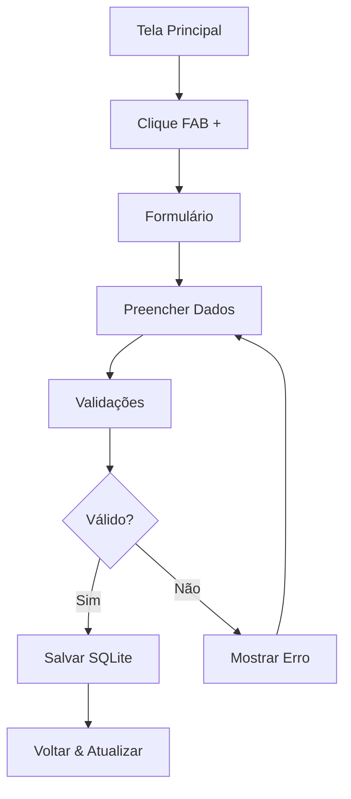
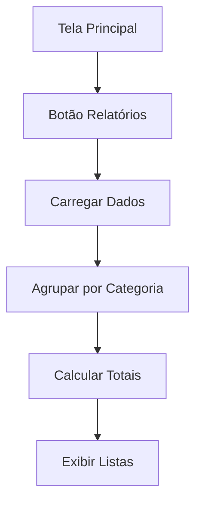

# 💰 App Finanças Pessoais

<div align="center">


**Um aplicativo Android completo para gestão de finanças pessoais**

[📱 Features](#-features) • [🚀 Quick Start](#-quick-start) • [📖 Documentação](#-documentação) • [🤝 Contribuindo](#-contribuindo)

</div>

---

## 📱 Features

### ✨ Principais Funcionalidades
- 💰 **Controle de Receitas e Despesas** - Adicione e gerencie suas transações
- 📊 **Dashboard Financeiro** - Visualize saldo, receitas e despesas em tempo real
- 🏷️ **Categorização Automática** - 14 categorias predefinidas para organização
- 📈 **Relatórios Detalhados** - Análise por categoria com totais consolidados
- 🗑️ **Exclusão Intuitiva** - Remova transações com long press + confirmação
- 📅 **Seletor de Data** - DatePicker integrado para datas precisas
- 🎨 **Material Design** - Interface moderna e responsiva
- 💾 **Armazenamento Local** - Dados seguros com SQLite

### 🎯 Categorias Disponíveis

**Receitas:** Salário • Freelance • Investimentos • Vendas • Outros

**Despesas:** Alimentação • Transporte • Moradia • Saúde • Educação • Lazer • Compras • Contas • Outros

---

## 🚀 Quick Start

### 📋 Pré-requisitos
- Android Studio 4.0+
- SDK Android 24+ (Android 7.0)
- Java 8+

### 🛠️ Instalação

1. **Clone o repositório**
```bash
git clone https://github.com/seu-usuario/financas-pessoais-android.git
cd financas-pessoais-android
```

2. **Abra no Android Studio**
```bash
# Ou abra diretamente no Android Studio
File → Open → Selecione a pasta do projeto
```

3. **Sync das dependências**
```bash
# O Android Studio fará automaticamente, ou:
File → Sync Project with Gradle Files
```

4. **Execute o projeto**
```bash
# Conecte um dispositivo Android ou inicie um emulador
Run → Run 'app' (Ctrl+F9)
```

### 📁 Estrutura do Projeto

```
app/
├── 📱 src/main/
│   ├── ☕ java/com/example/financaspessoais/
│   │   ├── MainActivity.java              # 🏠 Tela principal
│   │   ├── AddTransacaoActivity.java      # ➕ Formulário
│   │   ├── RelatoriosActivity.java        # 📊 Relatórios
│   │   ├── DatabaseHelper.java            # 🗄️ SQLite
│   │   ├── TransacaoAdapter.java          # 📋 Lista principal
│   │   ├── CategoriaAdapter.java          # 📈 Lista relatórios
│   │   ├── Transacao.java                 # 🏷️ Modelo principal
│   │   └── CategoriaResumo.java           # 📊 Modelo relatórios
│   ├── 🎨 res/
│   │   ├── layout/                        # 🖼️ Layouts XML
│   │   ├── drawable/                      # 🎯 Ícones e vetores
│   │   └── values/                        # 🌈 Cores e strings
│   └── 📄 AndroidManifest.xml
├── 🔧 build.gradle.kts
└── 📚 README.md
```

---

## 📖 Documentação

### 🎯 Regras de Negócio

| Regra | Descrição |
|-------|-----------|
| **RN001** | Transações devem ter tipo: `RECEITA` ou `DESPESA` |
| **RN002** | Categorização obrigatória baseada no tipo |
| **RN003** | Valores devem ser > 0 com máximo 2 casas decimais |
| **RN004** | Campos obrigatórios: descrição, valor, tipo, categoria |
| **RN005** | Saldo = Total Receitas - Total Despesas |
| **RN006** | Exclusão com confirmação obrigatória |
| **RN007** | Data padrão atual, editável via DatePicker |
| **RN008** | Relatórios agrupados por categoria |

### 🗄️ Banco de Dados

#### Tabela `transacoes`
| Campo | Tipo | Restrição | Descrição |
|-------|------|-----------|-----------|
| `id` | INTEGER | PK, AUTO_INCREMENT | Identificador único |
| `descricao` | TEXT | NOT NULL | Descrição da transação |
| `valor` | REAL | NOT NULL, > 0 | Valor monetário |
| `tipo` | TEXT | NOT NULL | 'RECEITA' ou 'DESPESA' |
| `categoria` | TEXT | NOT NULL | Categoria selecionada |
| `data` | TEXT | NOT NULL | Data formato DD/MM/AAAA |

#### Operações Principais
```sql
-- Inserir transação
INSERT INTO transacoes (descricao, valor, tipo, categoria, data) VALUES (?, ?, ?, ?, ?);

-- Buscar todas ordenadas por data
SELECT * FROM transacoes ORDER BY data DESC;

-- Total por tipo
SELECT SUM(valor) FROM transacoes WHERE tipo = ?;

-- Agrupamento por categoria
SELECT categoria, SUM(valor) FROM transacoes WHERE tipo = ? GROUP BY categoria;
```

### 🔄 Fluxos Principais

#### Adicionar Transação


#### Visualizar Relatórios


---

## 📱 Como Usar

### 1️⃣ Tela Principal (Dashboard)
- **📊 Resumo Financeiro**: Visualize saldo atual, receitas e despesas
- **📋 Últimas Transações**: Lista das transações mais recentes
- **➕ Botão Flutuante**: Adicionar nova transação
- **📈 Ver Relatórios**: Acessar análises detalhadas

### 2️⃣ Adicionar Transação
1. Toque no botão **+** azul
2. Preencha os dados:
    - **Descrição**: Ex: "Salário Janeiro"
    - **Valor**: Ex: 5000.00
    - **Tipo**: Receita ou Despesa
    - **Categoria**: Escolha da lista
    - **Data**: Toque para editar
3. Toque em **"Salvar"**

### 3️⃣ Ver Relatórios
- Toque em **"Ver Relatórios"**
- Visualize totais por categoria
- Analise padrões de gastos

### 4️⃣ Excluir Transação
- **Pressione e segure** uma transação
- Confirme a exclusão no diálogo
- ⚠️ **Ação irreversível!**

---

## 🔧 Desenvolvimento

### 📦 Dependências
```kotlin
dependencies {
    implementation("androidx.appcompat:appcompat:1.6.1")
    implementation("com.google.android.material:material:1.11.0")
    implementation("androidx.constraintlayout:constraintlayout:2.1.4")
    implementation("androidx.recyclerview:recyclerview:1.3.2")
    implementation("androidx.cardview:cardview:1.0.0")
    implementation("androidx.coordinatorlayout:coordinatorlayout:1.2.0")
}
```

### 🏗️ Arquitetura
```
┌─────────────────────────────────────┐
│           🎨 UI LAYER               │
│     Activities + Layouts            │
├─────────────────────────────────────┤
│        💼 BUSINESS LAYER            │
│    Validations + Rules              │
├─────────────────────────────────────┤
│        💾 DATA LAYER                │
│    DatabaseHelper + SQLite          │
├─────────────────────────────────────┤
│        📋 MODEL LAYER               │
│     POJOs + Entities                │
└─────────────────────────────────────┘
```

### 🎨 Design Patterns
- **MVC**: Model-View-Controller para organização
- **Adapter Pattern**: Para RecyclerViews
- **Singleton**: DatabaseHelper para conexões
- **Builder Pattern**: AlertDialogs e configurações

### ✅ Validações Implementadas
```java
// Descrição obrigatória
if (descricao.isEmpty()) {
    etDescricao.setError("Descrição é obrigatória");
    return;
}

// Valor numérico válido
try {
    valor = Double.parseDouble(valorStr);
    if (valor <= 0) {
        etValor.setError("Valor deve ser maior que zero");
        return;
    }
} catch (NumberFormatException e) {
    etValor.setError("Valor inválido");
    return;
}
```

---

### 📝 Padrões de Código
- **Nomenclatura**: camelCase para variáveis, PascalCase para classes
- **Comentários**: Em português, claros e concisos
- **Indentação**: 4 espaços
- **Validações**: Sempre implementar client-side

### 🐛 Reportar Bugs
Abra uma **Issue** com:
- Descrição detalhada do problema
- Passos para reproduzir
- Screenshots (se aplicável)
- Informações do dispositivo


## 📄 Licença

Este projeto é licenciado sob a **MIT License** - veja o arquivo [LICENSE](LICENSE) para detalhes.

---

<div align="center">

**⭐ Se este projeto te ajudou, considere dar uma estrela!**

**Desenvolvido com ❤️ em Java para Android**

[🔝 Voltar ao topo](#-app-finanças-pessoais)

</div>